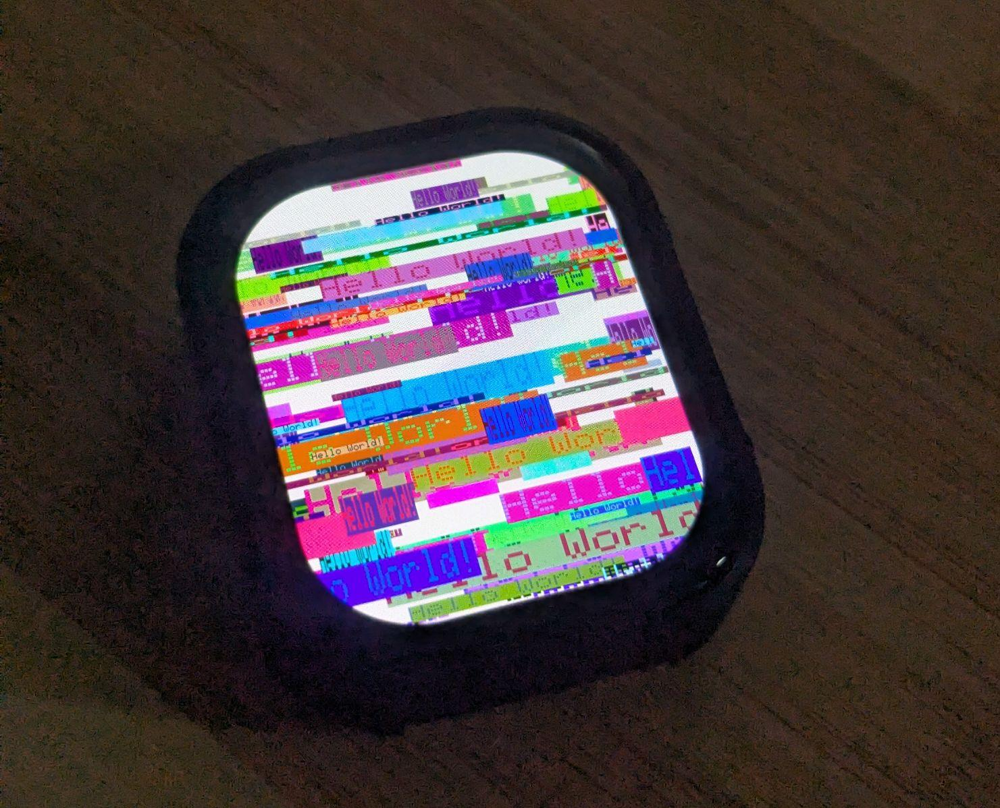

# Platform IO - Waveshare ESP32 S3 Touch AMOLED 2.06"

Example project displaying graphics on the Watch using the Arduino GFX Library.

[Waveshare Wiki](https://www.waveshare.com/wiki/ESP32-S3-Touch-AMOLED-2.06)



---

## Setup

### 1. Generate clangd compilation database

```bash
platformio run -t compiledb
```

---

## Run the code

### Compile code, flash and open serial monitor
```bash
platformio run -t upload && platformio run -t monitor
```
